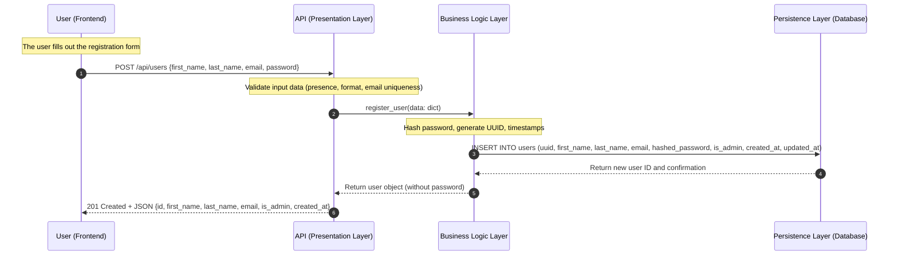
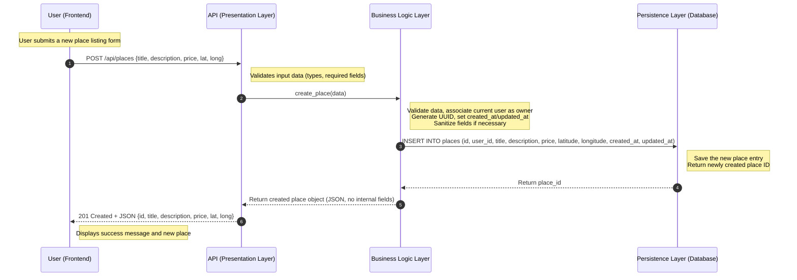
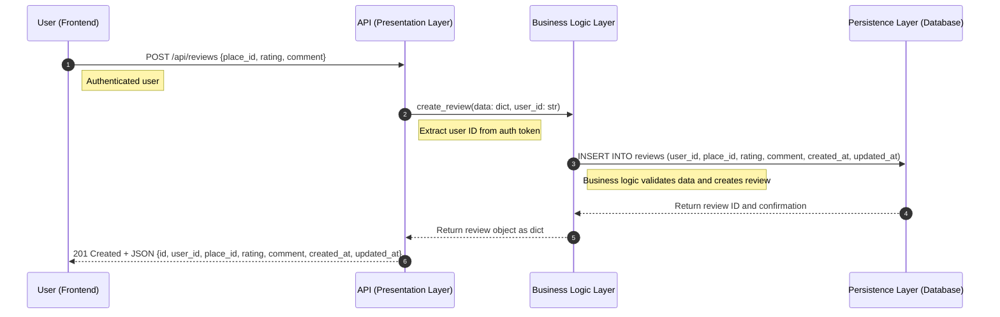
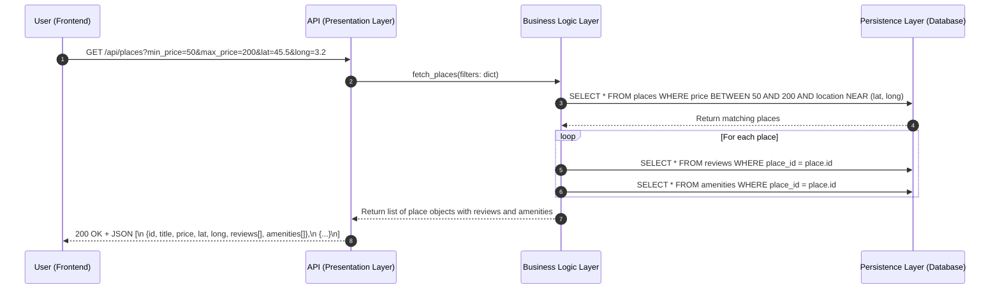

# Sequence Diagrams for API Calls

## Explanatory Notes

The following sequence diagrams describe how the different layers of the HBnB Evolution system collaborate to process common API requests.  
Each diagram highlights the interaction between the **Client**, **Presentation Layer (API)**, **Business Logic Layer**, and **Persistence Layer (Database)**, showing the step-by-step flow required to complete each operation.

---

### 1. **User Registration**

### Description

This sequence illustrates the process of creating a new user account. The system validates the submitted data, secures the password, stores the user information, and returns a safe response excluding sensitive fields.

---

### 2. **Place Creation**

### Description

This diagram represents the workflow for adding a new place. The system validates the provided information, links the place to its owner, and persists the data.

---

### 3. **Review Submission**

### Description

This sequence shows how a user submits a review for a place. The system ensures the user is authenticated, validates the review content, and saves it.

---

### 4. **Fetching a List of Places**

### Description

This diagram illustrates how the system retrieves a list of places based on optional filtering criteria and enriches the response with related data.

