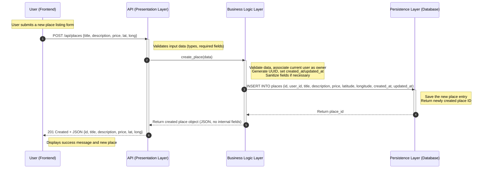
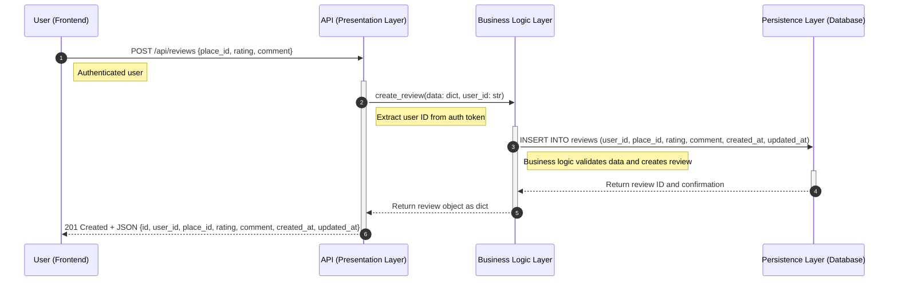
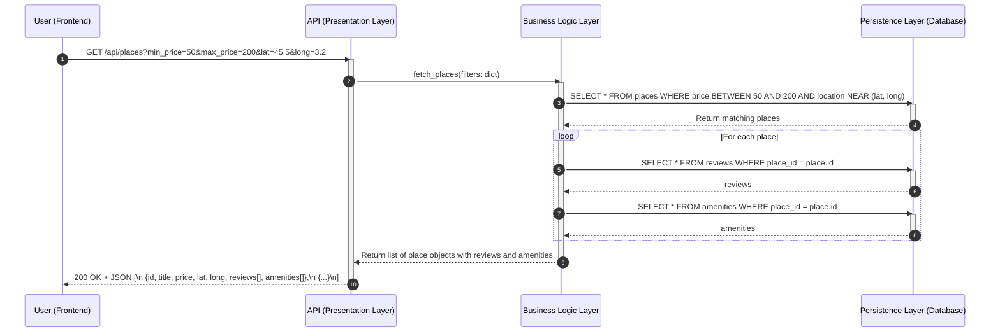

HBnB Project Technical Documentation
1. Introduction
Purpose:
This document serves as a comprehensive blueprint for the HBnB application. It consolidates the high-level package diagram, class diagrams for the business logic layer, and sequence diagrams for key API calls. Its goal is to provide a clear reference for implementation, design decisions, and system architecture.
Scope:
The document covers:
High-Level Architecture
Business Logic Layer (BLL)
API Interaction Flows
It is intended for developers and stakeholders to understand the system structure and interactions without ambiguity.
2. High-Level Architecture
High-Level Package Diagram
Explanatory Notes:
The high-level package diagram illustrates the three-layer architecture of the HBnB application and how layers communicate via the facade pattern.
Description of Layers:
Presentation Layer (Services, API):
Handles user interactions and exposes services/APIs.
Business Logic Layer (Models):
Contains the core business logic and entity models (User, Place, Review, Amenity).
Persistence Layer:
Manages data storage and retrieval from the database.
Diagram:

Design Decisions:
Separation of concerns using layered architecture.
Facade pattern simplifies interaction between layers.
Role:
Provides a conceptual overview of system organization and interactions between components.
3. Business Logic Layer (BLL)
Class Diagram
Explanatory Notes:
This diagram details the entities in the business logic layer, their attributes, methods, and relationships. Focused on core entities: User, Place, Review, Amenity.
Diagram (Mermaid):

```mermaid
%%{init: {
  'theme': 'dark',
  'themeVariables': {
    'darkMode': true,
    'primaryColor': '#161b22',
    'primaryTextColor': '#c9d1d9',
    'primaryBorderColor': '#30363d',
    'lineColor': '#58a6ff',
    'secondaryColor': '#0d1117',
    'tertiaryColor': '#21262d',
    'mainBkg': '#0d1117'
  }
}}%%

classDiagram
    class BaseModel {
        <<abstract>>
        -UUID id
        -DateTime created_at
        -DateTime updated_at
        +save() None
        #create() None
        #update() None
        #delete() None
    }

    class User {
        -String first_name
        -String last_name
        -String email
        -String password
        -bool is_admin
        +register(data dict) bool
        +update(data dict) bool
        +delete() bool
    }

    class Place {
        +String title
        +String description
        -float price
        -float latitude
        -float longitude
        +create(owner_id UUID, data dict) bool
        +update(data dict) bool
        +delete() bool
        +get_amenities() List~Amenity~
    }

    class Review {
        -User user
        -Place place
        -int rating
        -String comment
        +create(user_id UUID, place_id UUID, data dict) bool
        +update(data dict) bool
        +delete() bool
        +list_by_place(place_id UUID)
    }

    class Amenity {
        +String name
        +String description
        +create(data dict) bool
        +update(data dict) bool
        +delete() bool
        +get_amenities() List~Amenity~
    }

    %% Inheritance Relationships
    BaseModel <|-- User
    BaseModel <|-- Place
    BaseModel <|-- Review
    BaseModel <|-- Amenity

    %% Associations and Multiplicities
    User "1" -- "0..*" Place : owns
    User "1" -- "0..*" Review : writes
    Place "1" -- "0..*" Review : has
    Place "0..*" *-- "0..*" Amenity : features


    %% Notes Attachments
    note for User "email and password are private with validation
    password is write-only and hashed" 
    note for Place "price, latitude, longitude are validated in setters"
    note for Review "rating must be 1-5"
    note for Amenity "many-to-many relationship with Place"

Design Decisions:
BaseModel provides common fields and methods to all entities.
Relationships enforce ownership (User owns Place), reviews (Place has Reviews), and amenities.
Data validation and security (e.g., hashed passwords) are integrated in methods.
Role:
Ensures centralized processing of business rules and consistent handling of entities.
4. API Interaction Flow
Sequence Diagrams for Key API Calls
Explanatory Notes:
These diagrams show step-by-step how the system handles API requests, including interactions between Client, API Layer, Business Logic Layer, and Persistence Layer.
4.1 User Registration
```mermaid
sequenceDiagram
    autonumber
    participant Client as User (Frontend)
    participant API as API (Presentation Layer)
    participant Logic as Business Logic Layer
    participant DB as Persistence Layer (Database)

    Note over Client: The user fills out the registration form
    Client->>API: POST /api/users {first_name, last_name, email, password}
	activate API

    Note over API: Validate input data (presence, format, email uniqueness)
    API->>Logic: register_user(data: dict)
	activate Logic

    Note over Logic: Hash password, generate UUID, timestamps
    Logic->>DB: INSERT INTO users (uuid, first_name, last_name, email, hashed_password, is_admin, created_at, updated_at)
	activate DB

    DB-->>Logic: Return new user ID and confirmation
	deactivate DB
    Logic-->>API: Return user object (without password)
	deactivate Logic
    API-->>Client: 201 Created + JSON {id, first_name, last_name, email, is_admin, created_at}
deactivate API
```

Description:
Validates user input, hashes password, stores in DB, and returns safe response.
4.2 Place Creation



Description:
Adds new place, links to owner, and persists data.
4.3 Review Submission



Description:
Submits review, ensures authentication, validates data, saves to DB.
4.4 Fetching a List of Places



Description:
Retrieves places based on filters, enriches with reviews and amenities.
5. Review & Recommendations
Ensure clarity and consistency in terminology and diagram styles.
Keep naming conventions consistent across diagrams and code.
Verify accuracy of diagrams and flow sequences against actual implementation.
Proofread for professional formatting.
Repository Reference:
GitHub: holbertonschool-hbnb
Directory: part1
